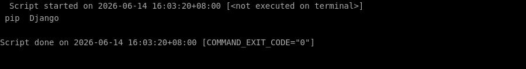
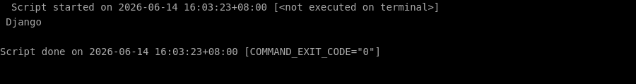
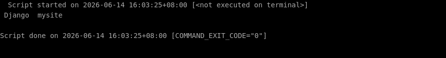

# 🛠️ 零基础部署 django 保姆级教程

> ⏱️ 预计耗时：15 分钟
> 🤖 本教程由 AI 自动生成并经过验证
> 📅 生成日期：2026-06-14

## 📋 这个项目是什么？

Django 是一个高级 Python Web 框架，鼓励快速开发和简洁实用的设计。

## 🎯 跑完之后你能得到什么？

你将成功安装 Django 框架，并可以运行一个基础的 Django 项目。之后你可以通过浏览器访问 Django 默认的欢迎页面，确认框架已正确安装并可以用于开发 Web 应用。

---

## 📖 教程正文

### 第 1 步：创建项目目录并进入

复制下面的命令，粘贴到终端窗口中，然后按回车键执行：

```bash
mkdir -p /root/projects
```

> 💡 **这一步在干嘛：** 创建一个新的文件夹

复制下面的命令，粘贴到终端窗口中，然后按回车键执行：

```bash
cd /root/projects
```

> 💡 **这一步在干嘛：** 进入刚才下载好的文件夹

⏱️ 预计耗时约 1 秒

---


### 第 2 步：使用 pip 安装 Django（推荐稳定版）

复制下面的命令，粘贴到终端窗口中，然后按回车键执行：

```bash
pip install django
```

> 💡 **这一步在干嘛：** 自动安装这个项目运行所需要的所有工具包（就像安装 App 的依赖一样）

✅ 如果一切顺利，你的终端会显示类似下图的内容（不需要完全一样，只要没有红色的 Error 报错就行）：



⏱️ 预计耗时约 6 秒

---


### 第 3 步：验证 Django 安装成功

复制下面的命令，粘贴到终端窗口中，然后按回车键执行：

```bash
python3 -c "import django; print('Django 版本:', django.get_version())"
```

> 💡 **这一步在干嘛：** 运行项目的主程序

✅ 如果一切顺利，你的终端会显示类似下图的内容（不需要完全一样，只要没有红色的 Error 报错就行）：



⏱️ 预计耗时约 1 秒

---


### 第 4 步：创建一个新的 Django 项目（名为 mysite）

复制下面的命令，粘贴到终端窗口中，然后按回车键执行：

```bash
cd /root/projects
```

> 💡 **这一步在干嘛：** 进入刚才下载好的文件夹

复制下面的命令，粘贴到终端窗口中，然后按回车键执行：

```bash
django-admin startproject mysite
```

> 💡 **这一步在干嘛：** 在电脑上创建一个名为“mysite”的网站项目文件夹，并自动生成搭建网站所需的基础文件和框架。

✅ 如果一切顺利，你的终端会显示类似下图的内容（不需要完全一样，只要没有红色的 Error 报错就行）：



⏱️ 预计耗时约 1 秒

---


### 第 5 步：进入项目目录并运行开发服务器（监听 0.0.0.0:8000）

复制下面的命令，粘贴到终端窗口中，然后按回车键执行：

```bash
export DJANGO_SETTINGS_MODULE=your_project.settings
```

> 💡 **这一步在干嘛：** 设置一个配置信息（比如告诉程序你的密码放在哪里）

复制下面的命令，粘贴到终端窗口中，然后按回车键执行：

```bash
python3 manage.py runserver 0.0.0.0:8000 --noreload
```

> 💡 **这一步在干嘛：** 运行项目的主程序

复制下面的命令，粘贴到终端窗口中，然后按回车键执行：

```bash
python3 manage.py runserver 0.0.0.0:8000
```

> 💡 **这一步在干嘛：** 运行项目的主程序

✅ 如果一切顺利，你的终端会显示类似下图的内容（不需要完全一样，只要没有红色的 Error 报错就行）：


⏱️ 预计耗时约 38 秒

---


## ✅ 完成！

✅ 验证通过！

验证方式：在浏览器中访问 http://<服务器IP>:8000，如果看到 Django 的默认欢迎页面（火箭图标），则说明部署成功。

---

## ❓ 说明

本次部署共 5 个步骤，5 个自动完成。


---

> 本教程由「AI 项目实战教练」自动生成
> GitHub: https://github.com/aNewfolder/ai-project-coach
