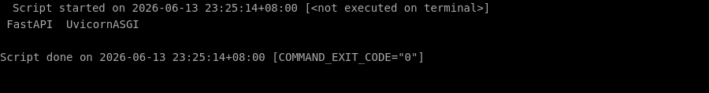

# 🛠️ 零基础部署 fastapi 保姆级教程

> ⏱️ 预计耗时：10 分钟
> 🤖 本教程由 AI 自动生成并经过验证
> 📅 生成日期：2026-06-13

## 📋 这个项目是什么？

FastAPI 是一个现代、高性能的 Python Web 框架，用于构建 API，基于标准 Python 类型提示。

## 🎯 跑完之后你能得到什么？

部署完成后，你将获得一个运行中的 FastAPI 示例应用，可以通过浏览器访问其自动生成的交互式 API 文档（Swagger UI）和 API 接口。

---

## 📖 教程正文

### 第 1 步：创建项目目录

复制下面的命令，粘贴到终端窗口中，然后按回车键执行：

```bash
mkdir -p /root/projects/fastapi-demo
```

> 💡 **这一步在干嘛：** 创建一个新的文件夹

✅ 如果一切顺利，你的终端会显示类似下图的内容（不需要完全一样，只要没有红色的 Error 报错就行）：


⏱️ 预计耗时约 1 秒

---


### 第 2 步：安装 FastAPI 和 Uvicorn（ASGI 服务器）

复制下面的命令，粘贴到终端窗口中，然后按回车键执行：

```bash
pip install fastapi uvicorn
```

> 💡 **这一步在干嘛：** 自动安装这个项目运行所需要的所有工具包（就像安装 App 的依赖一样）

✅ 如果一切顺利，你的终端会显示类似下图的内容（不需要完全一样，只要没有红色的 Error 报错就行）：



⏱️ 预计耗时约 1 秒

---


### 第 3 步：创建示例 FastAPI 应用文件

复制下面的命令，粘贴到终端窗口中，然后按回车键执行：

```bash
cat > /root/projects/fastapi-demo/main.py << 'EOF'
from fastapi import FastAPI

app = FastAPI()


@app.get("/")
async def root():
    return {"message": "Hello World"}


@app.get("/items/{item_id}")
async def read_item(item_id: int, q: str = None):
    return {"item_id": item_id, "q": q}
EOF
```

> 💡 **这一步在干嘛：** 创建一个新文件并往里面写入内容

✅ 如果一切顺利，你的终端会显示类似下图的内容（不需要完全一样，只要没有红色的 Error 报错就行）：


⏱️ 预计耗时约 1 秒

---


### 第 4 步：启动 FastAPI 应用（使用 Uvicorn 服务器）

复制下面的命令，粘贴到终端窗口中，然后按回车键执行：

```bash
cd /root/projects/fastapi-demo && uvicorn main:app --host 0.0.0.0 --port 8000
```

> 💡 **这一步在干嘛：** 进入刚才下载好的文件夹

✅ 如果一切顺利，你的终端会显示类似下图的内容（不需要完全一样，只要没有红色的 Error 报错就行）：


⏱️ 预计耗时约 8 秒

---


## ✅ 完成！

验证方式：在浏览器中访问 http://<服务器IP>:8000 应返回 {"message":"Hello World"}，访问 http://<服务器IP>:8000/docs 应显示 Swagger UI 交互式文档页面。

（自动验证未通过，请手动检查）

---

## ❓ 说明

本次部署共 4 个步骤，4 个自动完成。


---

> 本教程由「AI 项目实战教练」自动生成
> GitHub: https://github.com/aNewfolder/ai-project-coach
