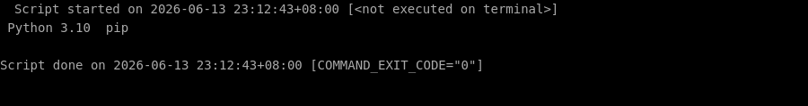
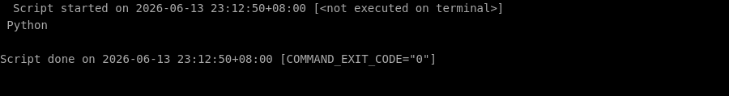
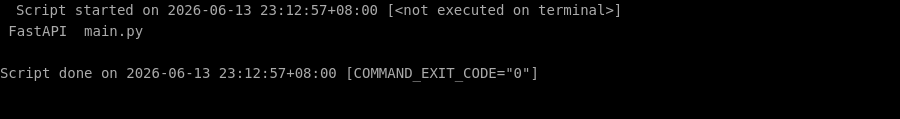

# 🛠️ 零基础部署 fastapi 保姆级教程

> ⏱️ 预计耗时：15 分钟
> 🤖 本教程由 AI 自动生成并经过验证
> 📅 生成日期：2026-06-13

## 📋 这个项目是什么？

FastAPI 是一个基于 Python 类型提示的现代、高性能 Web 框架，用于构建 API。

## 🎯 跑完之后你能得到什么？

部署完成后，你将获得一个运行在本地服务器上的 FastAPI 应用框架。你可以通过浏览器访问自动生成的交互式 API 文档（Swagger UI 和 ReDoc），并开始编写和测试自己的 API 接口。

---

## 📖 教程正文

### 第 1 步：更新系统包并安装 Python 3.10 和 pip

复制下面的命令，粘贴到终端窗口中，然后按回车键执行：

```bash
sudo apt update
```

> 💡 **这一步在干嘛：** 让系统检查一下有没有软件更新

复制下面的命令，粘贴到终端窗口中，然后按回车键执行：

```bash
sudo apt install -y python3.10 python3.10-venv python3-pip
```

> 💡 **这一步在干嘛：** 安装系统需要的基础软件

✅ 如果一切顺利，你的终端会显示类似下图的内容（不需要完全一样，只要没有红色的 Error 报错就行）：



⏱️ 预计耗时约 13 秒

---


### 第 2 步：创建项目目录并进入

复制下面的命令，粘贴到终端窗口中，然后按回车键执行：

```bash
mkdir -p ~/fastapi-project
```

> 💡 **这一步在干嘛：** 创建一个新的文件夹

复制下面的命令，粘贴到终端窗口中，然后按回车键执行：

```bash
cd ~/fastapi-project
```

> 💡 **这一步在干嘛：** 进入刚才下载好的文件夹

⏱️ 预计耗时约 1 秒

---


### 第 3 步：创建并激活 Python 虚拟环境

复制下面的命令，粘贴到终端窗口中，然后按回车键执行：

```bash
python3.10 -m venv venv
```

> 💡 **这一步在干嘛：** 运行项目的主程序

复制下面的命令，粘贴到终端窗口中，然后按回车键执行：

```bash
source venv/bin/activate
```

> 💡 **这一步在干嘛：** 激活一个虚拟环境（让后面的命令在独立空间里运行）

✅ 如果一切顺利，你的终端会显示类似下图的内容（不需要完全一样，只要没有红色的 Error 报错就行）：



⏱️ 预计耗时约 4 秒

---


### 第 4 步：升级 pip 并安装 FastAPI 和 Uvicorn（ASGI 服务器）

复制下面的命令，粘贴到终端窗口中，然后按回车键执行：

```bash
pip install --upgrade pip
```

> 💡 **这一步在干嘛：** 自动安装这个项目运行所需要的所有工具包（就像安装 App 的依赖一样）

复制下面的命令，粘贴到终端窗口中，然后按回车键执行：

```bash
pip install fastapi uvicorn
```

> 💡 **这一步在干嘛：** 自动安装这个项目运行所需要的所有工具包（就像安装 App 的依赖一样）

✅ 如果一切顺利，你的终端会显示类似下图的内容（不需要完全一样，只要没有红色的 Error 报错就行）：


⏱️ 预计耗时约 2 秒

---


### 第 5 步：创建一个简单的 FastAPI 应用文件 main.py

复制下面的命令，粘贴到终端窗口中，然后按回车键执行：

```bash
cat > main.py << 'EOF'
from fastapi import FastAPI

app = FastAPI()


@app.get("/")
def read_root():
    return {"Hello": "World"}


@app.get("/items/{item_id}")
def read_item(item_id: int, q: str = None):
    return {"item_id": item_id, "q": q}
EOF
```

> 💡 **这一步在干嘛：** 创建一个新文件并往里面写入内容

✅ 如果一切顺利，你的终端会显示类似下图的内容（不需要完全一样，只要没有红色的 Error 报错就行）：



⏱️ 预计耗时约 1 秒

---


## ✅ 完成！

验证方式：在浏览器中访问 http://<服务器IP>:8000 或使用 curl 命令测试根路径，应返回 {"Hello":"World"}。同时访问 http://<服务器IP>:8000/docs 可查看自动生成的 Swagger UI 文档。

（自动验证未通过，请手动检查）

---

## ❓ 说明

本次部署共 6 个步骤，5 个自动完成。
1 个步骤需要手动处理，详见下方「未能自动完成的步骤」。

## ⚠️ 未能自动完成的步骤

以下步骤在自动部署过程中未能成功，可能需要手动处理：

**使用 Uvicorn 启动 FastAPI 应用（监听所有网络接口，端口 8000）**

错误信息：`服务启动后立即退出`

---


---

> 本教程由「AI 项目实战教练」自动生成
> GitHub: https://github.com/aNewfolder/ai-project-coach
