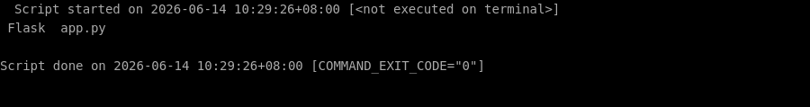
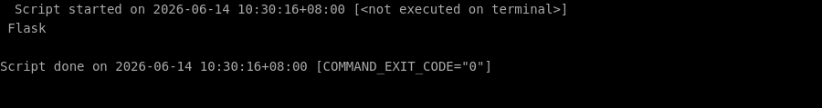

# 🛠️ 零基础部署 flask 保姆级教程

> ⏱️ 预计耗时：10 分钟
> 🤖 本教程由 AI 自动生成并经过验证
> 📅 生成日期：2026-06-14

## 📋 这个项目是什么？

Flask 是一个轻量级的 Python Web 框架，用于快速构建 Web 应用。

## 🎯 跑完之后你能得到什么？

部署完成后，你将拥有一个可运行的 Flask 开发环境，并可以启动一个简单的 Web 服务器，访问 http://127.0.0.1:5000 即可看到 Hello, World! 页面。

---

## 📖 教程正文

### 第 1 步：创建项目目录并进入

复制下面的命令，粘贴到终端窗口中，然后按回车键执行：

```bash
mkdir -p /root/projects/flask-app && cd /root/projects/flask-app
```

> 💡 **这一步在干嘛：** 进入刚才下载好的文件夹

⏱️ 预计耗时约 1 秒

---


### 第 2 步：安装 Flask

复制下面的命令，粘贴到终端窗口中，然后按回车键执行：

```bash
pip install flask
```

> 💡 **这一步在干嘛：** 自动安装这个项目运行所需要的所有工具包（就像安装 App 的依赖一样）

✅ 如果一切顺利，你的终端会显示类似下图的内容（不需要完全一样，只要没有红色的 Error 报错就行）：


⏱️ 预计耗时约 1 秒

---


### 第 3 步：创建简单的 Flask 应用文件 app.py

复制下面的命令，粘贴到终端窗口中，然后按回车键执行：

```bash
cat > /root/projects/flask-app/app.py << 'EOF'
from flask import Flask

app = Flask(__name__)

@app.route("/")
def hello():
    return "Hello, World!"
EOF
```

> 💡 **这一步在干嘛：** 创建一个新文件并往里面写入内容

✅ 如果一切顺利，你的终端会显示类似下图的内容（不需要完全一样，只要没有红色的 Error 报错就行）：



⏱️ 预计耗时约 1 秒

---


### 第 4 步：启动 Flask 开发服务器

复制下面的命令，粘贴到终端窗口中，然后按回车键执行：

```bash
cd /root/projects/flask-app && timeout 10 flask run --host=0.0.0.0 --port=5000
```

> 💡 **这一步在干嘛：** 进入刚才下载好的文件夹

复制下面的命令，粘贴到终端窗口中，然后按回车键执行：

```bash
cd /root/projects/flask-app && flask run --host=0.0.0.0 --port=5000
```

> 💡 **这一步在干嘛：** 进入刚才下载好的文件夹

✅ 如果一切顺利，你的终端会显示类似下图的内容（不需要完全一样，只要没有红色的 Error 报错就行）：



⏱️ 预计耗时约 38 秒

---


## ✅ 完成！

✅ 验证通过！

验证方式：在另一个终端中执行 curl 请求，如果返回 Hello, World! 则部署成功。

---

## ❓ 说明

本次部署共 4 个步骤，4 个自动完成。


---

> 本教程由「AI 项目实战教练」自动生成
> GitHub: https://github.com/aNewfolder/ai-project-coach
