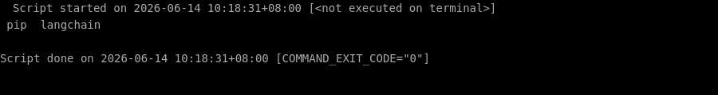

# 🛠️ 零基础部署 langchain 保姆级教程

> ⏱️ 预计耗时：5 分钟
> 🤖 本教程由 AI 自动生成并经过验证
> 📅 生成日期：2026-06-14

## 📋 这个项目是什么？

LangChain 是一个用于构建 LLM 驱动的智能体和应用的框架，提供标准接口来链接模型、工具和数据源。

## 🎯 跑完之后你能得到什么？

安装完成后，你将获得 LangChain 核心库，可以在 Python 中导入并使用其聊天模型、链、工具等组件。你可以用它快速搭建基于大语言模型的应用原型。

---

## 📖 教程正文

### 第 1 步：创建项目目录并进入

复制下面的命令，粘贴到终端窗口中，然后按回车键执行：

```bash
mkdir -p /root/projects && cd /root/projects
```

> 💡 **这一步在干嘛：** 进入刚才下载好的文件夹

⏱️ 预计耗时约 1 秒

---


### 第 2 步：使用 pip 安装 langchain 核心库

复制下面的命令，粘贴到终端窗口中，然后按回车键执行：

```bash
pip install langchain
```

> 💡 **这一步在干嘛：** 自动安装这个项目运行所需要的所有工具包（就像安装 App 的依赖一样）

✅ 如果一切顺利，你的终端会显示类似下图的内容（不需要完全一样，只要没有红色的 Error 报错就行）：



⏱️ 预计耗时约 1 秒

---


## ✅ 完成！

验证方式：执行 Python 命令导入 langchain 核心模块，如果输出 'LangChain 安装成功' 则表示部署成功。

（自动验证未通过，请手动检查）

---

## ❓ 说明

本次部署共 3 个步骤，2 个自动完成。
1 个步骤需要手动处理，详见下方「未能自动完成的步骤」。

## ⚠️ 未能自动完成的步骤

以下步骤在自动部署过程中未能成功，可能需要手动处理：

**验证安装：导入 langchain 核心模块确认成功**

错误信息：`/bin/sh: 1: Syntax error: word unexpected (expecting ")")`

---


---

> 本教程由「AI 项目实战教练」自动生成
> GitHub: https://github.com/aNewfolder/ai-project-coach
