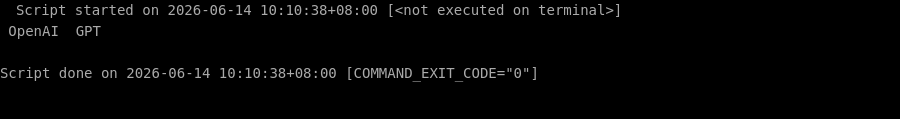
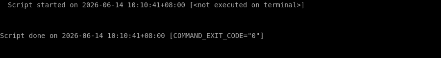

# 🛠️ 零基础部署 langchain 保姆级教程

> ⏱️ 预计耗时：10 分钟
> 🤖 本教程由 AI 自动生成并经过验证
> 📅 生成日期：2026-06-14

## 📋 这个项目是什么？

LangChain 是一个用于构建 LLM 驱动应用和智能体的框架，提供标准化的接口来链接模型、工具和数据源。

## 🎯 跑完之后你能得到什么？

安装完成后，你将获得 LangChain 核心库，可以在 Python 中直接调用大语言模型（如 OpenAI GPT）进行对话或构建链式应用。适合快速原型开发、模型切换和集成外部工具。

---

## 📖 教程正文

### 第 1 步：创建项目目录并进入

复制下面的命令，粘贴到终端窗口中，然后按回车键执行：

```bash
mkdir -p /root/projects/langchain && cd /root/projects/langchain
```

> 💡 **这一步在干嘛：** 进入刚才下载好的文件夹

⏱️ 预计耗时约 1 秒

---


### 第 2 步：安装 langchain 核心库（使用 uv 或 pip）

复制下面的命令，粘贴到终端窗口中，然后按回车键执行：

```bash
pip install langchain
```

> 💡 **这一步在干嘛：** 自动安装这个项目运行所需要的所有工具包（就像安装 App 的依赖一样）

✅ 如果一切顺利，你的终端会显示类似下图的内容（不需要完全一样，只要没有红色的 Error 报错就行）：


⏱️ 预计耗时约 9 秒

---


### 第 3 步：安装 OpenAI 集成包（用于调用 GPT 模型）

复制下面的命令，粘贴到终端窗口中，然后按回车键执行：

```bash
pip install langchain-openai
```

> 💡 **这一步在干嘛：** 自动安装这个项目运行所需要的所有工具包（就像安装 App 的依赖一样）

✅ 如果一切顺利，你的终端会显示类似下图的内容（不需要完全一样，只要没有红色的 Error 报错就行）：



⏱️ 预计耗时约 6 秒

---


### 第 4 步：设置 OpenAI API 密钥（请替换为你的真实密钥）

复制下面的命令，粘贴到终端窗口中，然后按回车键执行：

```bash
export OPENAI_API_KEY=your-api-key-here
```

> 💡 **这一步在干嘛：** 设置一个配置信息（比如告诉程序你的密码放在哪里）

⏱️ 预计耗时约 1 秒

---


### 第 5 步：创建测试脚本验证安装

复制下面的命令，粘贴到终端窗口中，然后按回车键执行：

```bash
cat > /root/projects/langchain/test_langchain.py << 'EOF'
from langchain.chat_models import init_chat_model

model = init_chat_model("openai:gpt-4o-mini")
result = model.invoke("Hello, world!")
print(result.content)
EOF
```

> 💡 **这一步在干嘛：** 创建一个新文件并往里面写入内容

✅ 如果一切顺利，你的终端会显示类似下图的内容（不需要完全一样，只要没有红色的 Error 报错就行）：



⏱️ 预计耗时约 1 秒

---


## ✅ 完成！

验证方式：运行测试脚本后，如果控制台输出模型返回的文本（例如 'Hello! How can I help you today?'），则说明安装成功。

（自动验证未通过，请手动检查）

---

## ❓ 说明

本次部署共 6 个步骤，5 个自动完成。
1 个步骤需要手动处理，详见下方「未能自动完成的步骤」。

## ⚠️ 未能自动完成的步骤

以下步骤在自动部署过程中未能成功，可能需要手动处理：

**运行测试脚本**

错误信息：`File "/root/projects/langchain/test_langchain.py", line 3
    model = init_chat_model(openai:gpt-4o-mini)
                                       ^
SyntaxError: invalid decimal literal`

---


---

> 本教程由「AI 项目实战教练」自动生成
> GitHub: https://github.com/aNewfolder/ai-project-coach
