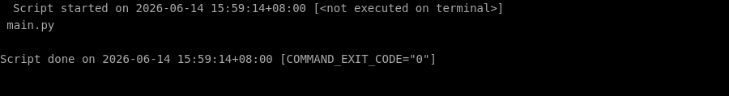
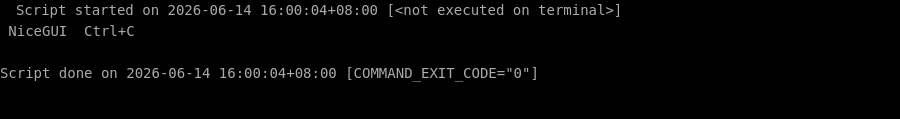

# 🛠️ 零基础部署 nicegui 保姆级教程

> ⏱️ 预计耗时：10 分钟
> 🤖 本教程由 AI 自动生成并经过验证
> 📅 生成日期：2026-06-14

## 📋 这个项目是什么？

NiceGUI 是一个基于 Python 的易用 UI 框架，可在浏览器中显示图形界面，适合微 Web 应用、仪表盘、机器人项目等。

## 🎯 跑完之后你能得到什么？

部署完成后，你将得到一个运行在本地浏览器中的 NiceGUI 示例应用，包含标签和按钮等基本交互组件。你可以通过 http://localhost:8080 访问它，并在此基础上开发自己的图形界面。

---

## 📖 教程正文

### 第 1 步：创建项目目录

复制下面的命令，粘贴到终端窗口中，然后按回车键执行：

```bash
mkdir -p /root/projects/nicegui && cd /root/projects/nicegui
```

> 💡 **这一步在干嘛：** 进入刚才下载好的文件夹

⏱️ 预计耗时约 1 秒

---


### 第 2 步：安装 NiceGUI 包

复制下面的命令，粘贴到终端窗口中，然后按回车键执行：

```bash
pip install nicegui
```

> 💡 **这一步在干嘛：** 自动安装这个项目运行所需要的所有工具包（就像安装 App 的依赖一样）

✅ 如果一切顺利，你的终端会显示类似下图的内容（不需要完全一样，只要没有红色的 Error 报错就行）：


⏱️ 预计耗时约 16 秒

---


### 第 3 步：创建示例应用 main.py

复制下面的命令，粘贴到终端窗口中，然后按回车键执行：

```bash
cat > /root/projects/nicegui/main.py << 'EOF'
from nicegui import ui

ui.label('Hello NiceGUI!')
ui.button('BUTTON', on_click=lambda: ui.notify('button was pressed'))

ui.run()
EOF
```

> 💡 **这一步在干嘛：** 创建一个新文件并往里面写入内容

✅ 如果一切顺利，你的终端会显示类似下图的内容（不需要完全一样，只要没有红色的 Error 报错就行）：



⏱️ 预计耗时约 1 秒

---


### 第 4 步：启动 NiceGUI 应用（前台运行，按 Ctrl+C 停止）

复制下面的命令，粘贴到终端窗口中，然后按回车键执行：

```bash
cd /root/projects/nicegui && python3 main.py
```

> 💡 **这一步在干嘛：** 进入刚才下载好的文件夹

复制下面的命令，粘贴到终端窗口中，然后按回车键执行：

```bash
cd /root/projects/nicegui && python3 main.py
```

> 💡 **这一步在干嘛：** 进入刚才下载好的文件夹

✅ 如果一切顺利，你的终端会显示类似下图的内容（不需要完全一样，只要没有红色的 Error 报错就行）：



⏱️ 预计耗时约 38 秒

---


## ✅ 完成！

✅ 验证通过！

验证方式：在浏览器中访问 http://localhost:8080，应看到 'Hello NiceGUI!' 标签和一个 'BUTTON' 按钮，点击按钮会弹出通知。

---

## ❓ 说明

本次部署共 4 个步骤，4 个自动完成。


---

> 本教程由「AI 项目实战教练」自动生成
> GitHub: https://github.com/aNewfolder/ai-project-coach
